# RelayLM 1.0 Architecture

<!-- generated-by: relaylm-architecture-projection -->
<!-- projection-schema-version: 1 -->
<!-- source-commit: ec23fe7955abff36517e41afa193d6dcdb24270e -->
<!-- package-version: 1.0.0rc1 -->

This document is a generated projection of RelayLM `v1` repository authority.
It is materialized at a version/release boundary from the frozen input commit
recorded above and is not hand-maintained. For each area the canonical
authority is the surface named under it, not this summary.

## Semantic owners

### actual_model_crystallization_llama_cpp

Evaluation-only off-turn Crystallization carriage onto the current v1 llama.cpp physical reference. It reuses the provider-neutral Crystallization semantics, exact native-schema request, llama.cpp runtime attestation, reasoning_effort=none realization, serialized-input counter, shared queue, and transaction-owned lifecycle without entering product runtime routing or making a scientific quality conclusion.

- owning Issue: #2811
- canonical authority: `docs/reference/actual-model-crystallization-llama-cpp.md`
- depends on: actual_model_evaluation, actual_model_llama_cpp_qualification, crystallization, physical_execution_queue, provider_and_api
- consumed by: none

### actual_model_evaluation

Actual-model execution/evidence authority for Core 1.0 two-pass-reference qualification, exact per-pass request identity including Pass 2 structured-output transport, provider-neutral current Stage R semantics with backend-specific physical admission, a v3 historical/current-vLLM execution template that binds the exact current scenario-set path/revision while historical plans remain loadable evidence, explicit scored-vs-unscored proposal-channel oracle semantics for new evaluation identities, claim-scoped qualification/regression/smoke review identity, Character-relative anomaly/product-quality review with citable turn-local Character-realization outcomes, Pass-2-only reasoning escalation on demonstrated semantic need, exact provider/model capability binding, capacity/timing evidence with bounded sanitized provider-failure diagnostic sidecars, citable pressure plan/evidence binding and derived-observation integrity including pressure summaries/deltas, and later optional single-pass optimization comparisons against a qualified reference.

- owning Issue: #1386
- canonical authority: `docs/reference/actual-model-character-authoring.md`, `docs/reference/actual-model-character-realization.md`, `docs/reference/actual-model-cognition-execution-evidence.md`, `docs/reference/actual-model-cognitive-budget-evidence.md`, `docs/reference/actual-model-crystallization-evidence.md`, `docs/reference/actual-model-crystallization-host-runner.md`, `docs/reference/actual-model-crystallization-lm-studio-observed.md`, `docs/reference/actual-model-crystallization-quality-fixture.md`, `docs/reference/actual-model-fast-screening.md`, `docs/reference/actual-model-host-runner.md`, `docs/reference/actual-model-lm-studio-binding.md`, `docs/reference/actual-model-stage-r-coverage.md`, `docs/reference/actual-model-stage-r-current.md`, `docs/reference/actual-model-stage-r-oracle.md`, `docs/reference/actual-model-vllm-binding.md`, `docs/reference/actual-model-vllm-budget-facade.md`, `docs/reference/actual-model-vllm-capability-probe.md`, `docs/reference/actual-model-vllm-capacity-acquisition.md`, `docs/reference/actual-model-vllm-functional-acceptance.md`, `docs/reference/actual-model-vllm-kv-allocation-geometry.md`, `docs/reference/actual-model-vllm-live-owner-preflight.md`, `docs/reference/actual-model-vllm-qualification-launcher.md`, `evaluation/actual_model/qualifications/core-semantic-v1.json`, `evaluation/actual_model/screenings/stage-r-current-v1.json`, `evaluation/actual_model/screenings/stage-r0-vllm-current-v1.json`
- depends on: cognitive_budget, cognitive_turn, continuity_context, crystallization, memory_provenance, persistence, provider_and_api, runtime_configuration, state_and_validation
- consumed by: actual_model_crystallization_llama_cpp, actual_model_llama_cpp_qualification, actual_model_vllm_reference_production, calibration, continuity_label_invariance_diagnostic, epistemic_formation_diagnostic, fixed_continuity_slot_diagnostic, lab_environment, lm_studio_semantic_first_qualification, production_continuity_only_diagnostic, production_continuity_only_physical, production_continuity_overlay_diagnostic, production_unresolved_no_pass1_diagnostic, production_unresolved_no_pass1_no_accepted_continuity_diagnostic, production_unresolved_no_pass1_no_accepted_continuity_physical, production_unresolved_no_pass1_physical, production_unresolved_only_diagnostic, production_unresolved_only_physical, semantic_continuity_projection_diagnostic, two_turn_diagnostic_carriage
- evidence produced: actual-model-cogp5-vllm-screening-v1, actual-model-crystallization-quality-v1, actual-model-foundation-scenarios-v1, actual-model-foundation-scenarios-v2, actual-model-foundation-scenarios-v3, actual-model-gemma-google-vllm-snapshot-target-v1, actual-model-gemma-lmstudio-target-v1, actual-model-gemma-target-v1, actual-model-gemma-vllm-snapshot-target-v1, actual-model-google-vllm-reasoning-proof-v1, actual-model-principle-only-prompt-v1, actual-model-stage-r-v2-execution-template, actual-model-stage-r-v3-execution-template, actual-model-vllm-reasoning-proof-v1

### actual_model_llama_cpp_qualification

Evaluation-only llama.cpp/llama-server physical qualification carriage for current RelayLM 1.0 actual-model Stage R, including a restartable pre-wrapper repo-external Python/runtime/import-closure controller gate, same-interpreter handoff into the repository-owned WSL/LocalCodex wrapper, transaction-owned llama-server log allocation directly inside the writable artifact root, OpenAI-compatible reasoning_effort=none Thinking-OFF realization, exact serialized-input counting parity, and a one-command transaction that owns one fresh single-slot llama-server process lifetime, one per-launch log, bounded 600-second request waits, exactly one citable host invocation at most, an explicit host-module to declared-summary result contract, deterministic teardown, reproducibility evidence, and PASS/SEMANTIC_FAIL/INFRA_INVALID classification without changing frozen Core semantics or production backend routing identity.

- owning Issue: #2603
- canonical authority: `docs/reference/actual-model-llama-cpp-controller-preflight.md`, `docs/reference/actual-model-llama-cpp-host-result-contract.md`, `docs/reference/actual-model-llama-cpp-qualification.md`, `docs/reference/actual-model-llama-cpp-transaction-log.md`, `docs/reference/installed-llama-cpp-physical-carriage.md`
- depends on: actual_model_evaluation, cognitive_turn, provider_and_api
- consumed by: actual_model_crystallization_llama_cpp, continuity_label_invariance_diagnostic, epistemic_formation_diagnostic, physical_execution_queue, production_continuity_only_physical, production_continuity_overlay_diagnostic, production_unresolved_no_pass1_no_accepted_continuity_physical, production_unresolved_no_pass1_physical, production_unresolved_only_physical, semantic_continuity_projection_physical, two_turn_diagnostic_carriage

### actual_model_vllm_reference_production

Window-independent zero-semantic vLLM launch preparation for citable token- capacity reference production, including the repository-authorized auto-fit model-length representation, bounded mechanical GPU-reservation feasibility, native runtime paths, owned readiness, and the producer/semantic-consumer boundary.

- owning Issue: #1386
- canonical authority: `docs/reference/actual-model-vllm-reference-launcher.md`
- depends on: actual_model_evaluation
- consumed by: none

### calibration

Calibration experiment matrix, candidate sweeps, continuation policy, numeric profile registry, and default provenance.

- owning Issue: #1388
- canonical authority: `docs/contracts/calibration-candidate-sweep.md`, `docs/contracts/calibration-continuation-gate.md`, `docs/contracts/calibration-evidence.md`, `docs/contracts/calibration-protected-workload.md`
- depends on: actual_model_evaluation, cognitive_budget, context_compiler
- consumed by: none
- evidence referenced: actual-model-foundation-scenarios-v2, actual-model-gemma-lmstudio-target-v1, actual-model-gemma-target-v1

### cognitive_budget

Cognitive budget accounting, protection tiers, degradation order, and enforcement.

- owning Issue: #1387
- canonical authority: `docs/contracts/cognitive-budget.md`
- depends on: context_compiler, knowledge, provider_and_api
- consumed by: actual_model_evaluation, calibration, cognitive_turn, evaluation, runtime_configuration

### cognitive_turn

Core 1.0 two-pass-first ordinary-turn cognition authority. Pass 1 and Pass 2 share one canonical cognitive prefix through CognitiveInput. At the external OpenAI-compatible two-pass boundary, canonical Event provenance is represented by deterministic request-local aliases and reverse-mapped to real Event IDs before existing source validation and deterministic commit authority; internal Event provenance and persistence remain unchanged. Pass 1 owns the visible character response with a minimal suffix; Pass 2 projects semantic State/Continuity proposals directly, without a model-authored interpretation scaffold. Canonical Pass-2 State and Continuity projection components are factorized; ordinary production Pass 2 separates already-accepted Continuity from the generic semantic-discovery context only after canonical compilation, then carries that exact prior lifecycle state through a dedicated read-only same-kind reconciliation channel while preserving selected State and every non-context CognitiveInput coordinate. Response-first scheduling proactively cancels and joins obsolete stale Pass 2 local tasks before a newer Pass 1 begins provider generation. Pass 2 extraction transport is selectable between RelayLM-owned ordinary-message JSON and provider-native JSON Schema constrained output, while RelayLM retains exact IR parsing/type construction plus deterministic State/Continuity authority. Fixed transcript turn replay preserves caller-supplied user/assistant Events, skips Pass 1 generation, and reuses the ordinary originating snapshot, Pass 2, stale guards, and deterministic State/Continuity commit boundary. single_pass remains compatibility/future optimization rather than a Core 1.0 quality gate.

- owning Issue: #1533
- canonical authority: `docs/architecture/cognitive-runtime.md`, `docs/contracts/cognition-execution-evidence.md`, `docs/contracts/cognition-execution-policy.md`, `docs/contracts/cognition-pass-execution.md`, `docs/contracts/cognitive-turn.md`, `docs/contracts/two-pass-scheduling.md`, `docs/reference/turn-retrieval-diagnostics.md`
- depends on: cognitive_budget, context_compiler, continuity_context, core_architecture, knowledge, provider_and_api, state_and_validation
- consumed by: actual_model_evaluation, actual_model_llama_cpp_qualification, continuity_label_invariance_diagnostic, epistemic_formation_diagnostic, evaluation, fixed_continuity_slot_diagnostic, lm_studio_semantic_first_qualification, runtime_configuration, two_turn_diagnostic_carriage

### context_compiler

Context authority, selection, retrieval discovery, lexical relevance semantics, and the C37 freeze boundary that keeps proactive deterministic semantic-grammar expansion evidence-triggered only.

- owning Issue: #1267
- canonical authority: `docs/architecture/context-compiler.md`, `docs/reference/context-compiler-semantic-boundary.md`, `docs/reference/event-retrieval-diagnostics.md`, `docs/reference/event-retrieval-discovery.md`, `docs/reference/memory-retrieval-diagnostics.md`, `docs/reference/retrieval-lexical-relevance.md`, `docs/reference/retrieval-lexical-semantics.md`
- depends on: continuity_context, core_architecture, memory_provenance, persistence, state_and_validation
- consumed by: calibration, cognitive_budget, cognitive_turn, evaluation

### continuity_context

Bounded short-term semantic continuity that is not yet durable character truth.

- owning Issue: #1371
- canonical authority: `docs/architecture/continuity-context.md`
- depends on: state_and_validation
- consumed by: actual_model_evaluation, cognitive_turn, context_compiler, epistemic_formation_diagnostic, evaluation, production_continuity_only_diagnostic, production_continuity_overlay_diagnostic, production_unresolved_no_pass1_diagnostic, production_unresolved_no_pass1_no_accepted_continuity_diagnostic, production_unresolved_only_diagnostic, runtime_configuration, semantic_continuity_projection_diagnostic, two_turn_diagnostic_carriage

### continuity_label_invariance_diagnostic

Evaluation-only current Stage R diagnostic that keeps canonical Continuity semantics fixed while replacing only the model-facing unresolved coordinate with the shadow alias open_question, then maps emitted transitions back to canonical unresolved before deterministic RelayLM authority. Its current physical carriage is llama.cpp; the historical LM Studio implementation is retained for its semantic contract and is not a fallback.

- owning Issue: #2385
- canonical authority: `docs/reference/actual-model-continuity-label-invariance.md`
- depends on: actual_model_evaluation, actual_model_llama_cpp_qualification, cognitive_turn, fixed_continuity_slot_diagnostic, lm_studio_semantic_first_qualification
- consumed by: none

### core_architecture

RelayLM 1.0 core architecture thesis, persistent character identity, and language/semantic normalization boundary.

- canonical authority: `docs/architecture/core.md`, `docs/architecture/identity.md`
- depends on: none
- consumed by: cognitive_turn, context_compiler, crystallization, knowledge, persistence, provider_and_api, state_and_validation

### crystallization

Structured semantic crystallization proposals with deterministic durable MEMORY projection and accepted StateCandidate validation.

- canonical authority: `docs/contracts/crystallization.md`
- depends on: core_architecture, memory_provenance, persistence, provider_and_api, state_and_validation
- consumed by: actual_model_crystallization_llama_cpp, actual_model_evaluation, evaluation

### development_workflow

The v1 development workflow, AI-development procedures, executable-realization dependency model, Realization Quality Audit admission/exit gates, CI verification guarantees, and repository-use practices.

- canonical authority: `docs/decisions/README.md`, `docs/reference/ai-development.md`, `docs/reference/ci-verification.md`, `docs/reference/development-workflow.md`, `docs/reference/document-lifecycle.md`, `docs/reference/executable-realization-dependencies.md`, `docs/reference/realization-quality-audit.md`, `docs/reference/repository-practices.md`
- depends on: none
- consumed by: repository_authority

### epistemic_formation_diagnostic

Evaluation-only current Stage R T2 probe that tests whether the model can form a source-grounded representation of information explicitly left not yet known, determined, or answered before any Continuity lifecycle projection. It uses no production cognition IR, no fixture-specific answer hint in the diagnostic instruction or native schema, and no T3 execution.

- owning Issue: #2516
- canonical authority: `docs/reference/actual-model-epistemic-formation-diagnostic.md`
- depends on: actual_model_evaluation, actual_model_llama_cpp_qualification, cognitive_turn, continuity_context
- consumed by: semantic_continuity_projection_diagnostic

### evaluation

Deterministic RelayLM-native evaluation registry, report contract, and boundary invariants.

- owning Issue: #1247
- canonical authority: `docs/reference/evaluation-budget-degradation-plan.md`, `docs/reference/evaluation-budget-owner-controls.md`, `docs/reference/evaluation-check-verdict.md`, `docs/reference/evaluation-cognitive-budget-turn-diagnostics.md`, `docs/reference/evaluation-cognitive-budget-turn-wiring.md`, `docs/reference/evaluation-continuity-active-task.md`, `docs/reference/evaluation-continuity-cognition-wiring.md`, `docs/reference/evaluation-continuity-context-retention.md`, `docs/reference/evaluation-continuity-lifecycle.md`, `docs/reference/evaluation-continuity-turn.md`, `docs/reference/evaluation-degree-state-memory-authority.md`, `docs/reference/evaluation-freeform-current-state-shadow.md`, `docs/reference/evaluation-memory-temporal-provenance.md`, `docs/reference/evaluation-openai-serialized-counter.md`, `docs/reference/evaluation-protected-serialized-floor.md`, `docs/reference/evaluation-retrieval-query-features.md`, `docs/reference/evaluation-retrieval-refinements.md`, `docs/reference/evaluation-retrieval-stage-diagnostics.md`, `docs/reference/evaluation-serialized-fit-enforcement.md`, `docs/reference/evaluation-serialized-input-fit.md`, `docs/reference/evaluation-total-budget-accounting.md`, `docs/reference/evaluation-total-budget-diagnostics.md`, `docs/reference/evaluation-working-context-diagnostics.md`, `docs/reference/evaluation.md`
- depends on: cognitive_budget, cognitive_turn, context_compiler, continuity_context, crystallization, memory_provenance, persistence, provider_and_api, runtime_configuration, state_and_validation
- consumed by: release_engineering

### external_qualification

External public-benchmark runner, launch-readiness, physical admission, and evidence contract for exact-RC bounded qualification without RelayLM Core semantic mutation.

- owning Issue: #1981
- canonical authority: `docs/reference/external-qualification-readiness.md`, `docs/reference/external-qualification.md`
- depends on: physical_execution_queue, release_engineering
- consumed by: lab_environment

### fixed_continuity_slot_diagnostic

Evaluation-only LM Studio Stage R diagnostic that makes the existing referent, unresolved, and active_task Continuity decisions mechanically explicit as fixed per-kind slots before translating emitted transitions back into the existing ContinuityCandidate grammar.

- owning Issue: #2358
- canonical authority: `docs/reference/actual-model-fixed-continuity-slots.md`
- depends on: actual_model_evaluation, cognitive_turn, lm_studio_semantic_first_qualification
- consumed by: continuity_label_invariance_diagnostic

### knowledge

Core 1.0 package-authored read-only reference KNOWLEDGE, including strict package loading, deterministic whole-file projection, model-facing separation from Identity/State/Event/MEMORY authority, and its independent Cognitive Budget envelope.

- owning Issue: #2003
- canonical authority: `docs/reference/knowledge.md`
- depends on: core_architecture
- consumed by: cognitive_budget, cognitive_turn, persistence, starter_packages

### lab_environment

Stable prepared Lab Environment identity and non-citable LAB3 exploratory sessions/rehearsals that reuse existing owned-runtime primitives before a separate fresh Qualification transaction.

- owning Issue: #2139
- canonical authority: `docs/reference/lab-environment.md`, `docs/reference/lab-session.md`
- depends on: actual_model_evaluation, external_qualification
- consumed by: none

### lm_studio_semantic_first_qualification

Repository-owned minimum-sufficient LM Studio Stage R qualification capsule for Core 1.0. Stable non-secret provider/model/context facts are declared by the physical transaction, the first provider request is semantic work, and request or explicit Pass-2 failures stop later scenarios without changing Core cognition semantics. The controller/host ownership boundary follows the v2-proven rule: controller observes and assembles; host validates and freezes.

- owning Issue: #2297
- canonical authority: `docs/reference/actual-model-lm-studio-semantic-first.md`
- depends on: actual_model_evaluation, cognitive_turn, provider_and_api
- consumed by: continuity_label_invariance_diagnostic, fixed_continuity_slot_diagnostic

### memory_provenance

MEMORY temporal provenance, canonical identity derivation, deterministic projection, and its carriage into retrieval.

- canonical authority: `docs/contracts/memory-provenance.md`
- depends on: persistence
- consumed by: actual_model_evaluation, context_compiler, crystallization, evaluation

### persistence

Cognitive Package portability, Character specialization, and the filesystem persistence boundary.

- canonical authority: `docs/architecture/persistence.md`, `docs/reference/character-directory.md`
- depends on: core_architecture, knowledge, state_and_validation
- consumed by: actual_model_evaluation, context_compiler, crystallization, evaluation, memory_provenance, runtime_configuration, starter_packages

### physical_execution_queue

v1 carriage of the branch-neutral llama.cpp-only one-shot physical controller. LocalCodex reuses one fingerprinted persistent Python environment across v1/v2, then serializes the canonical local GPU resource and enforces a final fresh-ref and environment-identity gate.

- owning Issue: #2660
- canonical authority: `.ai/physical/llama_cpp_targets.json`, `.ai/physical/python_environment_policy.json`, `docs/reference/physical-execution-queue.md`
- depends on: actual_model_llama_cpp_qualification
- consumed by: actual_model_crystallization_llama_cpp, external_qualification, production_unresolved_no_pass1_no_accepted_continuity_physical, production_unresolved_no_pass1_physical

### production_continuity_only_diagnostic

Evaluation-only #2624 discriminator that holds production T2 CognitiveInput, Pass 1 response, canonical Continuity projection rules, retained formed-meaning overlay, decoding/reasoning controls, provenance, and transport fixed while removing only new-State extraction instruction/output responsibility. It produces no physical evidence by itself.

- owning Issue: #2624
- canonical authority: `docs/reference/actual-model-production-continuity-only-diagnostic.md`
- depends on: actual_model_evaluation, continuity_context, production_continuity_overlay_diagnostic, provider_and_api
- consumed by: production_continuity_only_physical, production_unresolved_no_pass1_diagnostic, production_unresolved_only_diagnostic

### production_continuity_only_physical

Repository-owned llama.cpp one-shot physical carriage for the merged #2624 production-context Continuity-only discriminator. It executes ordinary production T1, ordinary T2 Pass 1, and exactly one canonical Continuity-only retained-formation T2 Pass 2 without making the product semantic verdict.

- owning Issue: #2659
- canonical authority: `docs/reference/actual-model-production-continuity-only-physical.md`
- depends on: actual_model_evaluation, actual_model_llama_cpp_qualification, production_continuity_only_diagnostic, two_turn_diagnostic_carriage
- consumed by: none

### production_continuity_overlay_diagnostic

Evaluation-only discriminator that restores the full ordinary production T1/T2 two-pass path while appending one retained source-grounded formed-meaning overlay only to T2 Pass 2. It distinguishes formation-to-extraction access failure from post-formation production multiplexing without changing Core.

- owning Issue: #2593
- canonical authority: `docs/reference/actual-model-production-continuity-overlay-diagnostic.md`
- depends on: actual_model_evaluation, actual_model_llama_cpp_qualification, continuity_context, semantic_continuity_projection_physical, two_turn_diagnostic_carriage
- consumed by: production_continuity_only_diagnostic, production_unresolved_no_pass1_diagnostic, production_unresolved_no_pass1_no_accepted_continuity_diagnostic

### production_unresolved_no_pass1_diagnostic

Evaluation-only #2697 discriminator that holds the merged production-context unresolved-only request, full T2 CognitiveInput, accepted lifecycle context, retained #2529 formation overlay, canonical unresolved projection grammar, response schema, decoding/reasoning and source validation fixed while removing only the canonical Pass 1 response component from diagnostic T2 Pass 2. It produces no physical evidence by itself.

- owning Issue: #2697
- canonical authority: `docs/reference/actual-model-production-unresolved-no-pass1-diagnostic.md`
- depends on: actual_model_evaluation, continuity_context, production_continuity_only_diagnostic, production_continuity_overlay_diagnostic, production_unresolved_only_diagnostic, provider_and_api
- consumed by: production_unresolved_no_pass1_no_accepted_continuity_diagnostic, production_unresolved_no_pass1_physical

### production_unresolved_no_pass1_no_accepted_continuity_diagnostic

Evaluation-only #2715 discriminator that uses the merged #2700 unresolved-only no-Pass1 request as baseline and removes only the already-compiled projected accepted-Continuity ContextItem prefix from model-facing T2 CognitiveInput. Selected State and every other CognitiveInput field remain fixed. It produces no physical evidence by itself.

- owning Issue: #2715
- canonical authority: `docs/reference/actual-model-production-unresolved-no-pass1-no-accepted-continuity-diagnostic.md`
- depends on: actual_model_evaluation, continuity_context, production_continuity_overlay_diagnostic, production_unresolved_no_pass1_diagnostic, production_unresolved_only_diagnostic, provider_and_api
- consumed by: production_unresolved_no_pass1_no_accepted_continuity_physical

### production_unresolved_no_pass1_no_accepted_continuity_physical

Thin v1-specific llama.cpp specialization for the #2715 accepted-Continuity context discriminator. Generic one-shot dispatch, persistent Python environment, queue/resource serialization and final fresh-ref authority are consumed from the shared physical_execution_queue contract rather than duplicated here.

- owning Issue: #2715
- canonical authority: `docs/reference/actual-model-production-unresolved-no-pass1-no-accepted-continuity-physical.md`
- depends on: actual_model_evaluation, actual_model_llama_cpp_qualification, physical_execution_queue, production_unresolved_no_pass1_no_accepted_continuity_diagnostic, production_unresolved_no_pass1_physical, two_turn_diagnostic_carriage
- consumed by: none

### production_unresolved_no_pass1_physical

Thin v1-specific llama.cpp specialization for the #2697 no-Pass1 discriminator. Generic one-shot dispatch, persistent Python environment, queue/resource serialization and final fresh-ref authority are consumed from the shared physical_execution_queue contract rather than duplicated here.

- owning Issue: #2697
- canonical authority: `docs/reference/actual-model-production-unresolved-no-pass1-physical.md`
- depends on: actual_model_evaluation, actual_model_llama_cpp_qualification, physical_execution_queue, production_unresolved_no_pass1_diagnostic, production_unresolved_only_physical, two_turn_diagnostic_carriage
- consumed by: production_unresolved_no_pass1_no_accepted_continuity_physical

### production_unresolved_only_diagnostic

Evaluation-only #2672 discriminator that holds production T2 CognitiveInput, accepted lifecycle context, Pass 1 response, retained formed-meaning overlay, canonical Continuity wire/source semantics, decoding/reasoning controls and transport fixed while removing only referent/active_task and multi-kind Continuity projection responsibility. It produces no physical evidence by itself.

- owning Issue: #2672
- canonical authority: `docs/reference/actual-model-production-unresolved-only-diagnostic.md`
- depends on: actual_model_evaluation, continuity_context, production_continuity_only_diagnostic, provider_and_api
- consumed by: production_unresolved_no_pass1_diagnostic, production_unresolved_no_pass1_no_accepted_continuity_diagnostic, production_unresolved_only_physical

### production_unresolved_only_physical

Repository-owned llama.cpp one-shot physical carriage for the merged #2672 production-context unresolved-only discriminator. It reuses the generic #2659 two-turn diagnostic carriage and executes ordinary production T1, ordinary T2 Pass 1, and exactly one canonical unresolved-only retained-formation T2 Pass 2 without making the product semantic verdict.

- owning Issue: #2676
- canonical authority: `docs/reference/actual-model-production-unresolved-only-physical.md`
- depends on: actual_model_evaluation, actual_model_llama_cpp_qualification, production_unresolved_only_diagnostic, two_turn_diagnostic_carriage
- consumed by: production_unresolved_no_pass1_physical

### provider_and_api

OpenAI-compatible provider protocol, backend identity/dialects, RelayLM-owned plain combined cognition IR transport and fail-closed parsing, explicit no-op-by-default model-facing request observation immediately before cognition transport, deterministic request-local two-pass provider provenance aliases with reverse mapping to canonical Event IDs before unchanged source validation and commit, canonical factorization of Pass-2 State and Continuity projection responsibilities, production Pass-2 accepted-Continuity lifecycle-channel separation after canonical Context/State compilation, decoding including capability-gated per-pass hard output-token carriage, reasoning control including attested LM Studio binary reasoning_effort carriage, cognition pass request carriage, exact serialized-input counting including two-pass carriage, bounded upstream HTTP error observability that excludes any configured provider API-key echo from JSON or text error detail, exact Pass-2 extraction-content normalization of one complete lowercase json Markdown fence before unchanged strict JSON/shape/source validation, backend capability attestation, identity, and public API boundary.

- canonical authority: `docs/contracts/openai-api.md`, `docs/contracts/provider-decoding.md`, `docs/contracts/provider-identity.md`, `docs/contracts/provider-pass2-lifecycle-channel.md`, `docs/contracts/provider-reasoning.md`, `docs/contracts/provider-wire.md`
- depends on: core_architecture
- consumed by: actual_model_crystallization_llama_cpp, actual_model_evaluation, actual_model_llama_cpp_qualification, cognitive_budget, cognitive_turn, crystallization, evaluation, lm_studio_semantic_first_qualification, production_continuity_only_diagnostic, production_unresolved_no_pass1_diagnostic, production_unresolved_no_pass1_no_accepted_continuity_diagnostic, production_unresolved_only_diagnostic, runtime_configuration

### release_engineering

Release identity, distribution, and the release-candidate mechanical gate.

- canonical authority: `docs/contracts/release-candidate.md`, `docs/contracts/release-distribution.md`, `docs/contracts/release-identity.md`
- depends on: evaluation, runtime_configuration, starter_packages
- consumed by: external_qualification

### repository_authority

Owner-local repository authority declarations, production implementation ownership coverage, derived realization dependency auditing, deterministic production implementation-integrity enforcement, owner-local qualification input selection and derived semantic fingerprinting, the root agent bootstrap, agent bootstrap read order, repository and upstream freshness contracts, ephemeral projection recipes, and persistent human documentation projection.

- owning Issue: #1525
- canonical authority: `.ai/README.md`, `.ai/agent-contract.yaml`, `.ai/projections/architecture-overview.yaml`, `.ai/projections/consumer-map.yaml`, `.ai/projections/dependency-map.yaml`, `.ai/projections/evidence-map.yaml`, `.ai/projections/repository-status.yaml`, `.ai/projections/semantic-owner-map.yaml`, `AGENTS.md`, `ARCHITECTURE.md`
- depends on: development_workflow
- consumed by: none

### runtime_configuration

Release runtime configuration, Cognitive Profile registry and routing carriage, stable calibration-profile type/selection/carriage semantics, downstream calibration-registry consumption, two-pass-first cognition carriage, Pass 2 structured-output transport selection, bounded stale-extraction scheduling consumption, explicit single-pass/two-pass Cognitive Budget carriage with provider hard-output-limit safety validation, named cognition-mode precedence, provider-backend selection, assembly, preflight, and operator semantics.

- owning Issue: #1446
- canonical authority: `docs/contracts/runtime-assembly.md`, `docs/contracts/runtime-configuration.md`, `docs/contracts/runtime-operator.md`
- depends on: cognitive_budget, cognitive_turn, continuity_context, persistence, provider_and_api
- consumed by: actual_model_evaluation, evaluation, release_engineering

### semantic_continuity_projection_diagnostic

Evaluation-only discriminator that holds a source-grounded epistemic observation fixed and tests only its projection into the canonical RelayLM Continuity candidate grammar. It does not alter production cognition, Continuity semantics, or Core.

- owning Issue: #2545
- canonical authority: `docs/reference/actual-model-semantic-continuity-projection-diagnostic.md`
- depends on: actual_model_evaluation, continuity_context, epistemic_formation_diagnostic
- consumed by: semantic_continuity_projection_physical

### semantic_continuity_projection_physical

Repository-owned llama.cpp carriage for one future exactly-once projection diagnostic that binds retained epistemic-formation evidence explicitly and performs no formation, Pass 1, State, or T3 generation.

- owning Issue: #2564
- canonical authority: `docs/reference/actual-model-semantic-continuity-projection-physical.md`
- depends on: actual_model_llama_cpp_qualification, semantic_continuity_projection_diagnostic
- consumed by: production_continuity_overlay_diagnostic

### starter_packages

First-party Starter Cognitive Package catalog, bundled semantic assets, and installed-artifact-safe materialization semantics.

- owning Issue: #1996
- canonical authority: `docs/reference/starter-packages.md`
- depends on: knowledge, persistence
- consumed by: release_engineering

### state_and_validation

Event/State separation, State candidate grammar including language-independent durability and epistemic-strength semantics, and validator acceptance.

- canonical authority: `docs/architecture/events-and-state.md`, `docs/contracts/state-candidate.md`, `docs/contracts/validator.md`
- depends on: core_architecture
- consumed by: actual_model_evaluation, cognitive_turn, context_compiler, continuity_context, crystallization, evaluation, persistence

### two_turn_diagnostic_carriage

Evaluation-only canonical llama.cpp carriage for bounded two-turn diagnostics. It owns T1/T2 ordering, the T1 production-commit gate, four-generation accounting, fixture/runtime preparation, reasoning-OFF mechanical checks, artifact/result framing, and leaves diagnostic-specific T2 Pass 2 request construction/parsing to an explicitly owned provider strategy.

- owning Issue: #2659
- canonical authority: `docs/reference/actual-model-two-turn-diagnostic-carriage.md`
- depends on: actual_model_evaluation, actual_model_llama_cpp_qualification, cognitive_turn, continuity_context
- consumed by: production_continuity_only_physical, production_continuity_overlay_diagnostic, production_unresolved_no_pass1_no_accepted_continuity_physical, production_unresolved_no_pass1_physical, production_unresolved_only_physical

## Dependency graph

```mermaid
graph LR
  actual_model_crystallization_llama_cpp --> actual_model_evaluation
  actual_model_crystallization_llama_cpp --> actual_model_llama_cpp_qualification
  actual_model_crystallization_llama_cpp --> crystallization
  actual_model_crystallization_llama_cpp --> physical_execution_queue
  actual_model_crystallization_llama_cpp --> provider_and_api
  actual_model_evaluation --> cognitive_budget
  actual_model_evaluation --> cognitive_turn
  actual_model_evaluation --> continuity_context
  actual_model_evaluation --> crystallization
  actual_model_evaluation --> memory_provenance
  actual_model_evaluation --> persistence
  actual_model_evaluation --> provider_and_api
  actual_model_evaluation --> runtime_configuration
  actual_model_evaluation --> state_and_validation
  actual_model_llama_cpp_qualification --> actual_model_evaluation
  actual_model_llama_cpp_qualification --> cognitive_turn
  actual_model_llama_cpp_qualification --> provider_and_api
  actual_model_vllm_reference_production --> actual_model_evaluation
  calibration --> actual_model_evaluation
  calibration --> cognitive_budget
  calibration --> context_compiler
  cognitive_budget --> context_compiler
  cognitive_budget --> knowledge
  cognitive_budget --> provider_and_api
  cognitive_turn --> cognitive_budget
  cognitive_turn --> context_compiler
  cognitive_turn --> continuity_context
  cognitive_turn --> core_architecture
  cognitive_turn --> knowledge
  cognitive_turn --> provider_and_api
  cognitive_turn --> state_and_validation
  context_compiler --> continuity_context
  context_compiler --> core_architecture
  context_compiler --> memory_provenance
  context_compiler --> persistence
  context_compiler --> state_and_validation
  continuity_context --> state_and_validation
  continuity_label_invariance_diagnostic --> actual_model_evaluation
  continuity_label_invariance_diagnostic --> actual_model_llama_cpp_qualification
  continuity_label_invariance_diagnostic --> cognitive_turn
  continuity_label_invariance_diagnostic --> fixed_continuity_slot_diagnostic
  continuity_label_invariance_diagnostic --> lm_studio_semantic_first_qualification
  crystallization --> core_architecture
  crystallization --> memory_provenance
  crystallization --> persistence
  crystallization --> provider_and_api
  crystallization --> state_and_validation
  epistemic_formation_diagnostic --> actual_model_evaluation
  epistemic_formation_diagnostic --> actual_model_llama_cpp_qualification
  epistemic_formation_diagnostic --> cognitive_turn
  epistemic_formation_diagnostic --> continuity_context
  evaluation --> cognitive_budget
  evaluation --> cognitive_turn
  evaluation --> context_compiler
  evaluation --> continuity_context
  evaluation --> crystallization
  evaluation --> memory_provenance
  evaluation --> persistence
  evaluation --> provider_and_api
  evaluation --> runtime_configuration
  evaluation --> state_and_validation
  external_qualification --> physical_execution_queue
  external_qualification --> release_engineering
  fixed_continuity_slot_diagnostic --> actual_model_evaluation
  fixed_continuity_slot_diagnostic --> cognitive_turn
  fixed_continuity_slot_diagnostic --> lm_studio_semantic_first_qualification
  knowledge --> core_architecture
  lab_environment --> actual_model_evaluation
  lab_environment --> external_qualification
  lm_studio_semantic_first_qualification --> actual_model_evaluation
  lm_studio_semantic_first_qualification --> cognitive_turn
  lm_studio_semantic_first_qualification --> provider_and_api
  memory_provenance --> persistence
  persistence --> core_architecture
  persistence --> knowledge
  persistence --> state_and_validation
  physical_execution_queue --> actual_model_llama_cpp_qualification
  production_continuity_only_diagnostic --> actual_model_evaluation
  production_continuity_only_diagnostic --> continuity_context
  production_continuity_only_diagnostic --> production_continuity_overlay_diagnostic
  production_continuity_only_diagnostic --> provider_and_api
  production_continuity_only_physical --> actual_model_evaluation
  production_continuity_only_physical --> actual_model_llama_cpp_qualification
  production_continuity_only_physical --> production_continuity_only_diagnostic
  production_continuity_only_physical --> two_turn_diagnostic_carriage
  production_continuity_overlay_diagnostic --> actual_model_evaluation
  production_continuity_overlay_diagnostic --> actual_model_llama_cpp_qualification
  production_continuity_overlay_diagnostic --> continuity_context
  production_continuity_overlay_diagnostic --> semantic_continuity_projection_physical
  production_continuity_overlay_diagnostic --> two_turn_diagnostic_carriage
  production_unresolved_no_pass1_diagnostic --> actual_model_evaluation
  production_unresolved_no_pass1_diagnostic --> continuity_context
  production_unresolved_no_pass1_diagnostic --> production_continuity_only_diagnostic
  production_unresolved_no_pass1_diagnostic --> production_continuity_overlay_diagnostic
  production_unresolved_no_pass1_diagnostic --> production_unresolved_only_diagnostic
  production_unresolved_no_pass1_diagnostic --> provider_and_api
  production_unresolved_no_pass1_no_accepted_continuity_diagnostic --> actual_model_evaluation
  production_unresolved_no_pass1_no_accepted_continuity_diagnostic --> continuity_context
  production_unresolved_no_pass1_no_accepted_continuity_diagnostic --> production_continuity_overlay_diagnostic
  production_unresolved_no_pass1_no_accepted_continuity_diagnostic --> production_unresolved_no_pass1_diagnostic
  production_unresolved_no_pass1_no_accepted_continuity_diagnostic --> production_unresolved_only_diagnostic
  production_unresolved_no_pass1_no_accepted_continuity_diagnostic --> provider_and_api
  production_unresolved_no_pass1_no_accepted_continuity_physical --> actual_model_evaluation
  production_unresolved_no_pass1_no_accepted_continuity_physical --> actual_model_llama_cpp_qualification
  production_unresolved_no_pass1_no_accepted_continuity_physical --> physical_execution_queue
  production_unresolved_no_pass1_no_accepted_continuity_physical --> production_unresolved_no_pass1_no_accepted_continuity_diagnostic
  production_unresolved_no_pass1_no_accepted_continuity_physical --> production_unresolved_no_pass1_physical
  production_unresolved_no_pass1_no_accepted_continuity_physical --> two_turn_diagnostic_carriage
  production_unresolved_no_pass1_physical --> actual_model_evaluation
  production_unresolved_no_pass1_physical --> actual_model_llama_cpp_qualification
  production_unresolved_no_pass1_physical --> physical_execution_queue
  production_unresolved_no_pass1_physical --> production_unresolved_no_pass1_diagnostic
  production_unresolved_no_pass1_physical --> production_unresolved_only_physical
  production_unresolved_no_pass1_physical --> two_turn_diagnostic_carriage
  production_unresolved_only_diagnostic --> actual_model_evaluation
  production_unresolved_only_diagnostic --> continuity_context
  production_unresolved_only_diagnostic --> production_continuity_only_diagnostic
  production_unresolved_only_diagnostic --> provider_and_api
  production_unresolved_only_physical --> actual_model_evaluation
  production_unresolved_only_physical --> actual_model_llama_cpp_qualification
  production_unresolved_only_physical --> production_unresolved_only_diagnostic
  production_unresolved_only_physical --> two_turn_diagnostic_carriage
  provider_and_api --> core_architecture
  release_engineering --> evaluation
  release_engineering --> runtime_configuration
  release_engineering --> starter_packages
  repository_authority --> development_workflow
  runtime_configuration --> cognitive_budget
  runtime_configuration --> cognitive_turn
  runtime_configuration --> continuity_context
  runtime_configuration --> persistence
  runtime_configuration --> provider_and_api
  semantic_continuity_projection_diagnostic --> actual_model_evaluation
  semantic_continuity_projection_diagnostic --> continuity_context
  semantic_continuity_projection_diagnostic --> epistemic_formation_diagnostic
  semantic_continuity_projection_physical --> actual_model_llama_cpp_qualification
  semantic_continuity_projection_physical --> semantic_continuity_projection_diagnostic
  starter_packages --> knowledge
  starter_packages --> persistence
  state_and_validation --> core_architecture
  two_turn_diagnostic_carriage --> actual_model_evaluation
  two_turn_diagnostic_carriage --> actual_model_llama_cpp_qualification
  two_turn_diagnostic_carriage --> cognitive_turn
  two_turn_diagnostic_carriage --> continuity_context
  core_architecture
  development_workflow
```

