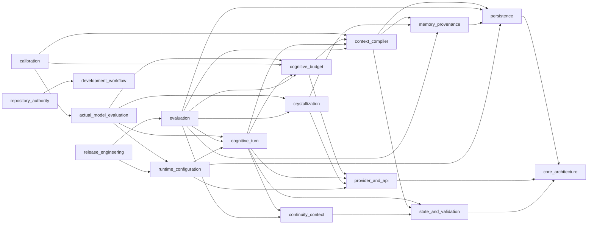

# RelayLM 1.0 Architecture

<!-- generated-by: relaylm-architecture-projection -->
<!-- projection-schema-version: 1 -->
<!-- source-commit: 769ab9a8f9067bd9b43d6e19f64196c5956806cf -->
<!-- package-version: 1.0.0.dev0 -->

This document is a generated projection of RelayLM `v1` repository authority.
It is materialized at a version/release boundary from the frozen input commit
recorded above and is not hand-maintained. For each area the canonical
authority is the surface named under it, not this summary.

## Semantic owners

### actual_model_evaluation

Actual-model execution, host runners, and reproducible evaluation evidence.

- owning Issue: #1386
- canonical authority: `docs/reference/actual-model-cognitive-budget-evidence.md`, `docs/reference/actual-model-crystallization-evidence.md`, `docs/reference/actual-model-crystallization-host-runner.md`, `docs/reference/actual-model-crystallization-quality-fixture.md`, `docs/reference/actual-model-host-runner.md`, `docs/reference/actual-model-lm-studio-binding.md`
- depends on: cognitive_budget, cognitive_turn, crystallization, runtime_configuration
- consumed by: calibration
- evidence produced: actual-model-crystallization-quality-v1, actual-model-foundation-scenarios-v1, actual-model-foundation-scenarios-v2, actual-model-gemma-lmstudio-target-v1, actual-model-gemma-target-v1

### calibration

Calibration experiment matrix, candidate sweeps, and default provenance.

- owning Issue: #1388
- canonical authority: `docs/contracts/calibration-candidate-sweep.md`, `docs/contracts/calibration-evidence.md`
- depends on: actual_model_evaluation, cognitive_budget, context_compiler
- consumed by: none
- evidence referenced: actual-model-foundation-scenarios-v2, actual-model-gemma-lmstudio-target-v1, actual-model-gemma-target-v1

### cognitive_budget

Cognitive budget accounting, protection tiers, degradation order, and enforcement.

- owning Issue: #1387
- canonical authority: none
- depends on: context_compiler, provider_and_api
- consumed by: actual_model_evaluation, calibration, cognitive_turn, evaluation

### cognitive_turn

One semantic cognitive generation per ordinary turn and its runtime assembly.

- owning Issue: #1259
- canonical authority: `docs/architecture/cognitive-runtime.md`, `docs/contracts/cognitive-turn.md`, `docs/reference/turn-retrieval-diagnostics.md`
- depends on: cognitive_budget, context_compiler, continuity_context, provider_and_api, state_and_validation
- consumed by: actual_model_evaluation, evaluation, runtime_configuration

### context_compiler

Context authority, selection, retrieval discovery, and lexical relevance semantics.

- owning Issue: #1267
- canonical authority: `docs/architecture/context-compiler.md`, `docs/reference/event-retrieval-diagnostics.md`, `docs/reference/event-retrieval-discovery.md`, `docs/reference/memory-retrieval-diagnostics.md`, `docs/reference/retrieval-lexical-relevance.md`, `docs/reference/retrieval-lexical-semantics.md`
- depends on: memory_provenance, persistence, state_and_validation
- consumed by: calibration, cognitive_budget, cognitive_turn, evaluation

### continuity_context

Bounded short-term semantic continuity that is not yet durable character truth.

- owning Issue: #1371
- canonical authority: `docs/architecture/continuity-context.md`
- depends on: state_and_validation
- consumed by: cognitive_turn, evaluation

### core_architecture

RelayLM 1.0 core architecture thesis and persistent character identity.

- canonical authority: `docs/architecture/core.md`, `docs/architecture/identity.md`
- depends on: none
- consumed by: persistence, provider_and_api, state_and_validation

### crystallization

Crystallization of accepted evidence into durable MEMORY authority.

- canonical authority: `docs/contracts/crystallization.md`
- depends on: memory_provenance, provider_and_api
- consumed by: actual_model_evaluation, evaluation

### development_workflow

The v1 development workflow and repository-use practices.

- canonical authority: `docs/decisions/README.md`, `docs/reference/development-workflow.md`, `docs/reference/repository-practices.md`
- depends on: none
- consumed by: repository_authority

### evaluation

Deterministic RelayLM-native evaluation registry and boundary invariants.

- owning Issue: #1247
- canonical authority: `docs/reference/evaluation-budget-degradation-plan.md`, `docs/reference/evaluation-budget-owner-controls.md`, `docs/reference/evaluation-cognitive-budget-turn-diagnostics.md`, `docs/reference/evaluation-cognitive-budget-turn-wiring.md`, `docs/reference/evaluation-continuity-active-task.md`, `docs/reference/evaluation-continuity-cognition-wiring.md`, `docs/reference/evaluation-continuity-context-retention.md`, `docs/reference/evaluation-continuity-lifecycle.md`, `docs/reference/evaluation-continuity-turn.md`, `docs/reference/evaluation-degree-state-memory-authority.md`, `docs/reference/evaluation-freeform-current-state-shadow.md`, `docs/reference/evaluation-memory-temporal-provenance.md`, `docs/reference/evaluation-openai-serialized-counter.md`, `docs/reference/evaluation-protected-serialized-floor.md`, `docs/reference/evaluation-retrieval-query-features.md`, `docs/reference/evaluation-retrieval-refinements.md`, `docs/reference/evaluation-retrieval-stage-diagnostics.md`, `docs/reference/evaluation-serialized-fit-enforcement.md`, `docs/reference/evaluation-serialized-input-fit.md`, `docs/reference/evaluation-total-budget-accounting.md`, `docs/reference/evaluation-total-budget-diagnostics.md`, `docs/reference/evaluation-working-context-diagnostics.md`, `docs/reference/evaluation.md`
- depends on: cognitive_budget, cognitive_turn, context_compiler, continuity_context, crystallization, memory_provenance, persistence
- consumed by: release_engineering

### memory_provenance

MEMORY temporal provenance and its carriage into retrieval.

- canonical authority: none
- depends on: persistence
- consumed by: context_compiler, crystallization, evaluation

### persistence

Character Package portability and the filesystem persistence boundary.

- canonical authority: `docs/architecture/persistence.md`, `docs/reference/character-directory.md`
- depends on: core_architecture
- consumed by: context_compiler, evaluation, memory_provenance, runtime_configuration

### provider_and_api

OpenAI-compatible provider wire, decoding, identity, and public API boundary.

- canonical authority: `docs/contracts/openai-api.md`, `docs/contracts/provider-decoding.md`, `docs/contracts/provider-identity.md`, `docs/contracts/provider-wire.md`
- depends on: core_architecture
- consumed by: cognitive_budget, cognitive_turn, crystallization, runtime_configuration

### release_engineering

Release identity, distribution, and the release-candidate mechanical gate.

- canonical authority: `docs/contracts/release-candidate.md`, `docs/contracts/release-distribution.md`, `docs/contracts/release-identity.md`
- depends on: evaluation, runtime_configuration
- consumed by: none

### repository_authority

Owner-local repository authority declarations, the agent bootstrap read order, the repository freshness contract, ephemeral projection recipes, and persistent human documentation projection.

- owning Issue: #1525
- canonical authority: `.ai/README.md`, `.ai/agent-contract.yaml`, `.ai/projections/architecture-overview.yaml`, `.ai/projections/consumer-map.yaml`, `.ai/projections/dependency-map.yaml`, `.ai/projections/evidence-map.yaml`, `.ai/projections/repository-status.yaml`, `.ai/projections/semantic-owner-map.yaml`, `ARCHITECTURE.md`
- depends on: development_workflow
- consumed by: none

### runtime_configuration

Runtime configuration, assembly, preflight, and operator semantics.

- canonical authority: `docs/contracts/runtime-assembly.md`, `docs/contracts/runtime-configuration.md`, `docs/contracts/runtime-operator.md`
- depends on: cognitive_turn, persistence, provider_and_api
- consumed by: actual_model_evaluation, release_engineering

### state_and_validation

Event/State separation, State candidate grammar, and validator acceptance.

- canonical authority: `docs/architecture/events-and-state.md`, `docs/contracts/state-candidate.md`, `docs/contracts/validator.md`
- depends on: core_architecture
- consumed by: cognitive_turn, context_compiler, continuity_context

## Dependency graph

