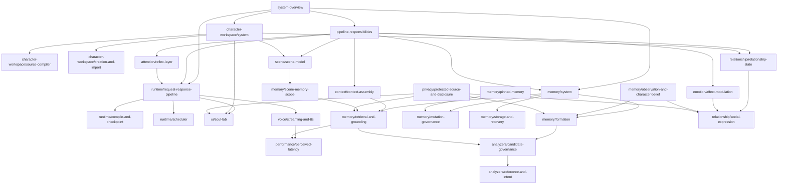

# Documentation Target Architecture Graph

This document defines the target canonical architecture document graph for the hard cutover. It is a synthesis plan, not a set of current file paths. Target files are created only in cutover PRs after the v0.1 frozen tag receipt.

## Graph design rules

1. A node represents one durable authority with one owner, update trigger, lifecycle, and primary consumer set.
2. System nodes describe repository-wide context and cross-subsystem responsibility.
3. Subsystem nodes describe independently changing components or services.
4. Concept/policy nodes describe semantics or governance crossing component boundaries.
5. Exact fields, gates, schemas, state transitions, and forbidden behavior live in contracts, not graph nodes.
6. Implementation slices, audits, validation runs, and dated evaluations are evidence leaves, not architecture nodes.
7. Planning, strategy, reference, operations, and release documents may link to the graph but do not become architecture parents.
8. A milestone name never becomes the canonical node name.

## Target graph



The arrows mean “requires architectural context from,” not runtime call direction. Runtime call direction is documented inside the relevant system or subsystem page and in exact contracts.

## System architecture nodes

### `architecture/system-overview.md`

- **Owner:** architecture
- **Update trigger:** repository-level component set, external boundary, privacy boundary, or deployment model changes.
- **Primary consumers:** new contributors, AI agents, cross-cutting design review.

Owns:

- RelayLM system context and external actors;
- component map and authority hierarchy;
- high-level trust, privacy, and persistence boundaries;
- navigation to pipeline and subsystem architecture.

Does not own exact ordering, field schemas, current status, or implementation history.

Primary sources:

- current architecture router context;
- `pipeline_responsibility_design.md` system-level sections;
- canonical subsystem boundaries and privacy constraints;
- durable sections of product/runtime hardening design.

### `architecture/pipeline-responsibilities.md`

- **Owner:** architecture/runtime
- **Update trigger:** component ownership or canonical request/response ordering changes.
- **Primary consumers:** runtime implementation, integration tests, architecture review.

Owns:

- canonical component order;
- request-side and response-side responsibility map;
- explicit non-responsibilities;
- cross-component control and data-flow overview.

Primary sources:

- `pipeline_responsibility_design.md`;
- P0 REL/SCN/EMO ordering rationale;
- safe compile-chain design;
- response-side style and attention/reflex ownership sources.

Exact stage interfaces and gates link to contracts.

### `architecture/character-workspace/system.md`

- **Owner:** character-workspace
- **Update trigger:** editable source set, compiler tier, workspace ownership, or activation model changes.
- **Primary consumers:** workspace compiler, UI, character creation, SLP maintenance.

Owns:

- file-first source authority;
- editable versus generated artifact boundary;
- compiler projection tiers;
- relationship/scene/memory workspace integration;
- activation and approval boundaries.

Primary sources:

- `character-workspace/system.md` and `character-workspace/source-compiler.md`;
- stable portions of CW-A1 through CW-A5;
- RelaySOUL file-first source-set rationale.

### `architecture/memory/system.md`

- **Owner:** memory
- **Update trigger:** memory classes, persistence authority, formation/retrieval/mutation ownership, or lifecycle changes.
- **Primary consumers:** RelayMEM, RelaySLP, RelayCTX, governance UI.

Owns:

- memory subsystem context;
- Primary MEM and related artifact roles;
- lifecycle responsibility map;
- formation, retrieval, mutation, storage/recovery child boundaries;
- privacy and provenance relationship.

Primary sources:

- `memory_lifecycle_design.md`;
- `relaymem_mvp_design.md`;
- `relaymem_slp_execution_design.md`;
- stable current behavior confirmed by status/contracts.

### `architecture/runtime/request-response-pipeline.md`

- **Owner:** runtime
- **Update trigger:** request orchestration, response finalization, backend invocation, or stage-runner boundary changes.
- **Primary consumers:** app/runtime maintainers, stage implementers, integration tests.

Owns:

- request lifecycle from input to backend and final response;
- response finalization ownership;
- stage composition and failure containment;
- relation to scheduler, compile/checkpoint, UI, and voice.

Primary sources:

- pipeline architecture;
- runtime hardening design;
- response-service/stage separation implementation evidence after stable synthesis.

## Subsystem architecture nodes

### Runtime

- `architecture/runtime/compile-and-checkpoint.md` — compile gate, checkpoint/recovery ownership, durable versus transient runtime state.
- `architecture/runtime/scheduler.md` — one-round, two-lane, supervised service, always-on wrapper, idempotency, and mutation-authority boundaries.

### Character Workspace

- `architecture/character-workspace/source-compiler.md` — source tree, parser, validation, compiled projections, cache tiers, and explicit non-activation.
- `architecture/character-workspace/creation-and-import.md` — Quick/Advanced creation, template import, showcase import, local approval, and commit boundary.
- `architecture/character-workspace/maintenance-candidates.md` — dry-run-first SLP-maintained proposals for generated memory/scene/relationship material.

### Memory

- `architecture/memory/formation.md` — observation admission, queueing, worker formation, candidate classification, provenance, and durable finalization.
- `architecture/memory/retrieval-and-grounding.md` — query formation, scoped candidate discovery, grounding, unsupported-detail suppression, and fallback ordering.
- `architecture/memory/mutation-governance.md` — Correct, Forget/Hide, Pin/Unpin, Held Apply/Discard, auditability, and shared mutation fences.
- `architecture/memory/storage-and-recovery.md` — durable index/log ownership, reconciliation, cleanup, crash recovery, and isolation.

### Character behavior layers

- `architecture/relationship/relationship-state.md` — target-specific relationship sources, directionality, dimensions, and interaction-policy inputs.
- `architecture/scene/scene-model.md` — scene state, audience, scene wiki, classifier ownership, and SCN non-responsibilities.
- `architecture/emotion/affect-modulation.md` — transient affect, relationship-conditioned gain, response style, and durable-mutation prohibition.
- `architecture/context/context-assembly.md` — context selection, packing, cache-friendly tiers, retrieval integration, and injection limits.
- `architecture/attention/reflex-layer.md` — fast bounded attention/reflex decisions and their non-authority over durable state.

### UI, voice, and performance

- `architecture/ui/soul-lab.md` — browser/server authority, conversation, observation, lifecycle visibility, and governance action surfaces.
- `architecture/voice/streaming-and-tts.md` — stream sentinel, suppression, segmentation, adapter, transport, and content boundaries.
- `architecture/performance/perceived-latency.md` — latency budget ownership and user-perceived timing without embedding dated measurements.

### Analyzers

- `architecture/analyzers/candidate-governance.md` — shared analyzer candidate lifecycle, multilingual structured-output policy, fallback, and validation ownership.
- `architecture/analyzers/reference-and-intent.md` — reference and intent analysis responsibilities after RelayREF/RelayINT consolidation.

## Concept and policy nodes

### `architecture/memory/pinned-memory.md`

Defines pinned normal memory as ordinary retrieval memory protected from ordinary maintenance. It links to mutation and ranking contracts but does not own API fields.

### `architecture/memory/scene-memory-scope.md`

Defines scene-aware memory scope, matching semantics, disclosure constraints, and interaction with RelaySCN/RelayMEM.

### `architecture/memory/observation-and-character-belief.md`

Defines the separation of observation, shared evidence assessment, character-conditioned provisional belief, and utterance. ADR decision authority remains separate.

### `architecture/relationship/social-expression.md`

Defines relationship-, scene-, emotion-, audience-, and disclosure-conditioned expression without conflating strong relationship with permission.

### `architecture/privacy/protected-source-and-disclosure.md`

Defines provenance, protected source, audience scope, content-free diagnostics, disclosure permission, and public/private evidence boundaries across subsystems.

Concept nodes link to component architecture and exact contracts; they do not duplicate component implementation details.

## Contract adjacency

The graph expects contract families rather than one contract per architecture page.

```text
contracts/
├── runtime/
│   ├── compile-gate.md
│   ├── checkpoint-and-recovery.md
│   ├── scheduler-round.md
│   └── tts-transport.md
├── character-workspace/
│   ├── source-tree.md
│   ├── parser-and-validation.md
│   ├── compiled-projections.md
│   └── creation-commit.md
├── memory/
│   ├── job-admission.md
│   ├── durable-queue.md
│   ├── worker-outcome.md
│   ├── durable-finalization.md
│   ├── retrieval-candidate.md
│   ├── correct.md
│   ├── forget-hide.md
│   ├── pin-unpin.md
│   └── held-apply-discard.md
├── analyzers/
│   ├── candidate.md
│   ├── query-detail.md
│   ├── retrieval-normalization.md
│   ├── reference-intent.md
│   └── scene-classifier.md
├── relationship/
├── scene/
└── diagnostics/
```

This is a grouping plan, not authorization to split existing contracts arbitrarily. Preparation C records the exact source block and digest for every rebuilt contract.

## Source-to-node synthesis map

| Current source family | Canonical graph nodes |
|---|---|
| pipeline responsibility, safe compile chain, P0 ordering | system overview; pipeline responsibilities; request-response pipeline |
| file-first workspace and CW-A1–A5 | workspace system; source compiler; creation/import; maintenance candidates; UI |
| memory lifecycle, RelayMEM/SLP design, Phase 6, I1, M3 | memory system; formation; retrieval; storage/recovery; scheduler |
| I-3/I-4/I-5/I-7 | memory mutation governance; pinned memory; UI; contracts |
| RelayREL, character belief/social expression | relationship state; observation/belief; social expression; privacy |
| scene scope, ACG-6, SCN ownership cleanup | scene model; scene-memory scope; analyzer governance |
| RelayEMO cleanup/style adapter | affect modulation; social expression; response pipeline |
| context packing and wake loop | context assembly; retrieval integration |
| ACG-1–6 | analyzer governance; reference/intent; scene model; retrieval; contracts |
| O0–O3 and O1A–F | scheduler; operations; contracts; implementation/validation evidence |
| SOUL Lab A/B and UI mutation slices | UI; request-response pipeline; memory mutation; evidence |
| Phase 55 and LAT sources | voice streaming/TTS; perceived latency; contracts; evidence |

## Parent-child and cross-link rules

- Every subsystem has exactly one primary system parent.
- Cross-cutting concept nodes may link to several subsystems but own no component lifecycle.
- System pages link down; subsystem pages do not repeat the system map.
- Architecture links to contracts for exact behavior.
- Contracts link back to the smallest relevant architecture node.
- Evidence links to the authority it verifies but is never a parent of active architecture.
- `PROJECT_STATUS.md` remains the current implementation authority and is not a graph node.

## Creation and review order

The target graph should be synthesized in this order:

1. system overview and pipeline responsibilities;
2. character workspace system and memory system;
3. request-response pipeline;
4. core child subsystems: source compiler, memory formation, retrieval, mutation, storage/recovery, relationship, scene, emotion, context;
5. UI, scheduler, analyzer, attention, voice, and performance subsystems;
6. concept/policy nodes;
7. contract extraction and adjacency normalization;
8. router rewrite and orphan/duplicate review.

Child pages may be drafted earlier, but no old source is deleted until its durable content, normative blocks, evidence disposition, and incoming links are accounted for.

## Graph completion criteria

The graph is ready for cutover when Preparation C verifies:

- every retained architecture source maps to at least one graph node or explicit non-architecture destination;
- every graph node has owner, update trigger, parent, consumer, source map, and contract adjacency;
- no graph node is named after a phase, wave, PR, or slice;
- no two nodes claim the same primary authority;
- every split source has a section-level target map;
- every contract source has normative-block extraction and digest instructions;
- evidence-only sources do not remain graph nodes;
- the router can reach every active node without using historical evidence as a navigation parent.

No target node is current merely because it appears in this graph.
